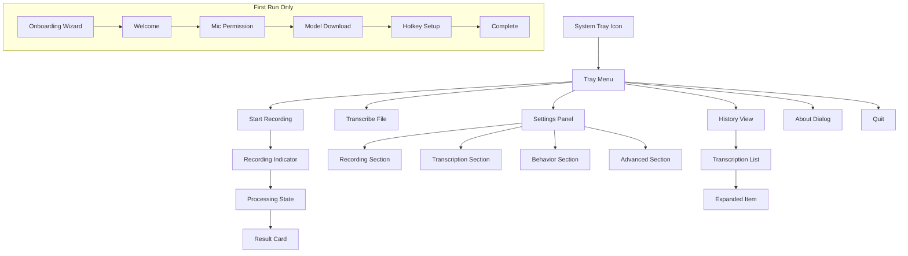
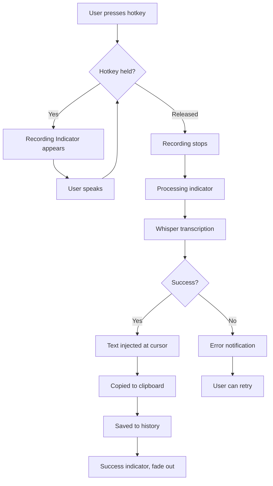
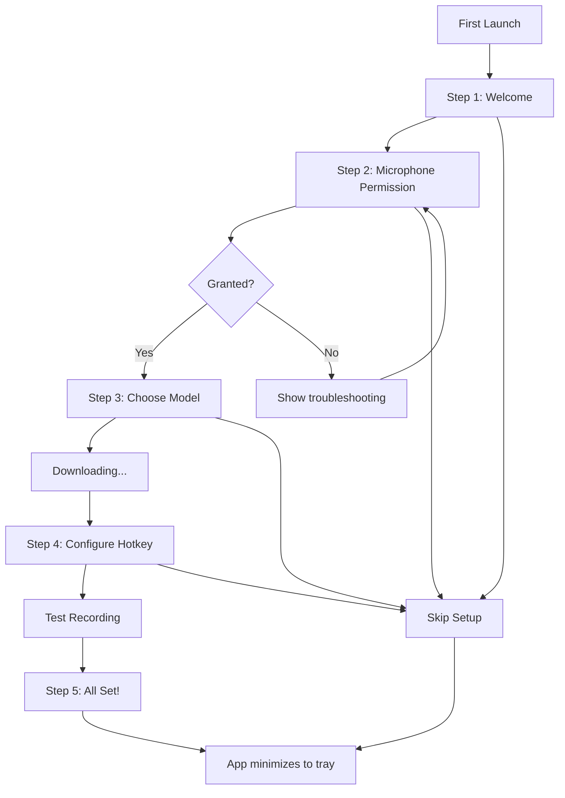
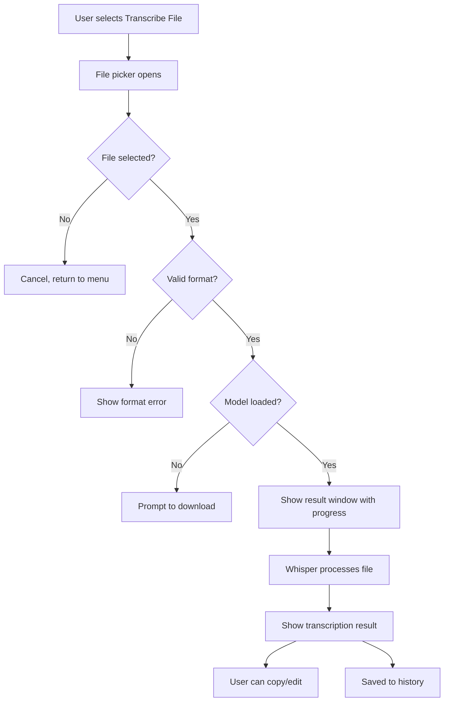

# EZ Flow UI/UX Specification

## Change Log

| Date | Version | Description | Author |
|------|---------|-------------|--------|
| 2024-12-28 | 1.0 | Initial UI/UX specification with EZCorp design system | Sally (UX Expert) |

---

## 1. Introduction

This document defines the user experience goals, information architecture, user flows, and visual design specifications for EZ Flow's user interface. It serves as the foundation for visual design and frontend development, ensuring a cohesive and user-centered experience following the EZCorp Design System.

### 1.1 Overall UX Goals & Principles

#### Target User Personas

| Persona | Description | Primary Needs |
|---------|-------------|---------------|
| **Everyday User** | Writers, students, professionals who want hands-free text input | Simple push-to-talk, instant results, no learning curve |
| **Power User / Developer** | Programmers who want CLI access and customization | Hotkey config, model selection, scripting integration |
| **Privacy Advocate** | Users who refuse cloud-based transcription | Transparency about local-only processing, no network calls |

#### Usability Goals

1. **Zero Learning Curve**: New users can transcribe on first try (hold hotkey, speak, release)
2. **Invisible When Idle**: App stays out of the way until needed - lives in system tray
3. **Sub-3-Second Response**: From release to text appearing at cursor
4. **Error Prevention**: Clear feedback for permission issues, missing models, or failures
5. **Memorable**: Infrequent users can return without relearning

#### Design Principles (EZCorp)

1. **Less is More** - Remove everything that doesn't serve the user
2. **Whitespace is King** - Generous spacing creates clarity and focus
3. **Speed Matters** - Fast load times, instant feedback, no bloat
4. **Subtle Interactions** - Micro-animations that delight without distracting
5. **Dark Mode Native** - System-level theme detection built-in
6. **Accessible by Default** - WCAG 2.1 AA minimum, keyboard navigation, screen reader friendly

---

## 2. Information Architecture (IA)

### 2.1 Screen Inventory



### 2.2 Navigation Structure

**Primary Navigation:** System tray menu - always accessible via right-click or left-click on tray icon

**Secondary Navigation:** Back arrows in Settings and History views to return to previous screen

**No Breadcrumbs:** App is shallow (max 2 levels deep), breadcrumbs unnecessary

---

## 3. User Flows

### 3.1 Core Flow: Push-to-Talk Transcription

**User Goal:** Dictate text that appears at cursor position in any application

**Entry Points:**
- Global hotkey (Ctrl+Shift+Space)
- "Start Recording" in tray menu

**Success Criteria:** Transcribed text appears at cursor within 3 seconds of releasing hotkey



**Edge Cases & Error Handling:**
- No microphone permission: Show permission request with platform-specific guidance
- No model downloaded: Prompt to download model (redirect to onboarding step 3)
- Transcription fails: Show error notification, don't inject garbage text
- No focused text field: Copy to clipboard, show "Copied!" confirmation

### 3.2 First-Run Onboarding Flow

**User Goal:** Set up EZ Flow for first use

**Entry Points:**
- First app launch
- "Setup Wizard" button in Settings

**Success Criteria:** User completes setup with working microphone, downloaded model, and configured hotkey



### 3.3 File Transcription Flow

**User Goal:** Transcribe an existing audio file

**Entry Points:**
- "Transcribe File..." in tray menu
- Drag-and-drop onto tray icon (if supported)

**Success Criteria:** File transcribed and text available to copy



---

## 4. Wireframes & Key Screen Layouts

### 4.1 Recording Indicator (Floating Pill)

**Purpose:** Visual feedback during recording, non-intrusive, always-on-top

```
┌──────────────────────────────────────┐
│  🎙  ▁▃▅▇▅▃▁▃▅▇▅▃▁   0:03           │
└──────────────────────────────────────┘
```

**Key Elements:**
- Microphone icon (left)
- Real-time waveform visualization (center)
- Timer counting up MM:SS (right)
- Pulsing yellow border when recording
- Green border on success (brief flash)

**States:**
| State | Appearance | Duration |
|-------|------------|----------|
| Recording | Yellow (#F4C430) glow, waveform animates | Until user releases |
| Processing | "Transcribing..." text, progress bar | 0.5-5 seconds |
| Success | Green border, "Done!" text, checkmark | 1.5 seconds, then fades |
| Error | Red border, error message | Until dismissed |

**Interaction Notes:**
- Appears 200ms after recording starts (avoid flicker on accidental taps)
- Position: bottom-right, 24px from edges (configurable)
- Click to expand/show cancel option
- Escape key cancels recording

### 4.2 Transcription Result Card

**Purpose:** Show completed transcription with quick actions

```
┌───────────────────────────────────────────────────┐
│                                              ✕    │
│   "Hello, this is a test transcription that      │
│    shows how the text would appear after         │
│    recording. Pretty neat, right?"               │
│                                                   │
│   ──────────────────────────────────────────     │
│                                                   │
│   📋 Copy    📝 Edit    🗑️ Discard              │
│                                                   │
│   ─ ─ ─ ─ ─ ─ ─ ─ ─ ─ ─ ─ ─ ─ ─ ─ ─ ─ ─ ─      │
│   ⚡ 1.2s  •  📊 base  •  🌐 English            │
└───────────────────────────────────────────────────┘
```

**Key Elements:**
- Transcription text (selectable, editable)
- Close button (top-right)
- Action buttons: Copy, Edit, Discard
- Metadata: transcription time, model used, language detected

**Interaction Notes:**
- Auto-appears after processing (optional setting)
- Can be disabled if user wants "fire and forget" mode
- Edit mode: text becomes editable, Save/Cancel buttons appear

### 4.3 Settings Panel

**Purpose:** Configure all app preferences

```
┌─────────────────────────────────────────────────────────┐
│  ← Back                           EZ Flow Settings      │
├─────────────────────────────────────────────────────────┤
│                                                          │
│  RECORDING                                               │
│  ─────────────────────────────────────────────────────  │
│  Hotkey                         [ Ctrl+Shift+Space  ▾ ] │
│  Recording Mode      ○ Push-to-talk  ● Toggle           │
│                                                          │
│  TRANSCRIPTION                                           │
│  ─────────────────────────────────────────────────────  │
│  Model                           [ ▼ base (142 MB)     ]│
│  Language                        [ Auto-detect       ▾ ] │
│                                                          │
│  BEHAVIOR                                                │
│  ─────────────────────────────────────────────────────  │
│  Auto-paste to cursor            [━━━━━━━━━●] ON        │
│  Copy to clipboard               [━━━━━━━━━●] ON        │
│  Start with system               [●━━━━━━━━━] OFF       │
│                                                          │
│  ▶ Advanced                                              │
│                                                          │
│  ─────────────────────────────────────────────────────  │
│  "Your voice, your device. No BS." 🔒                   │
└─────────────────────────────────────────────────────────┘
```

**Sections:**
1. **Recording** - Hotkey, mode selection
2. **Transcription** - Model, language
3. **Behavior** - Auto-paste, clipboard, startup
4. **Advanced** (collapsed) - Injection delay, indicator position, GPU, debug logging, export/import

### 4.4 History View

**Purpose:** Browse and manage past transcriptions

```
┌─────────────────────────────────────────────────────────┐
│  ← Back                                     History 📜  │
├─────────────────────────────────────────────────────────┤
│  🔍 [ Search transcriptions...                    ]     │
│                                                          │
│  Today                                                   │
│  ┌─────────────────────────────────────────────────┐    │
│  │  "Hello, this is a test transcription..."       │    │
│  │  2:34 PM  •  1.2s  •  base        [ 📋 ] [ 🗑️ ] │    │
│  └─────────────────────────────────────────────────┘    │
│                                                          │
│  ┌─────────────────────────────────────────────────┐    │
│  │  "Meeting notes for the Q4 planning session..." │    │
│  │  11:15 AM  •  45.3s  •  medium    [ 📋 ] [ 🗑️ ] │    │
│  └─────────────────────────────────────────────────┘    │
│                                                          │
│  Yesterday                                               │
│  └── (more items...)                                     │
│                                                          │
│  [ 🗑️ Clear All History ]                               │
└─────────────────────────────────────────────────────────┘
```

**Key Elements:**
- Search input with instant filtering
- Date groupings (Today, Yesterday, This Week, etc.)
- Expandable items showing full text
- Quick actions: Copy, Delete
- Clear all with confirmation

### 4.5 Onboarding Wizard

**Purpose:** Guide first-time setup

5 steps, each full-screen with centered content:

1. **Welcome** - Logo, tagline, "Get Started" button
2. **Microphone** - Permission request with reassurance about privacy
3. **Model Download** - Choose model size, show download progress
4. **Hotkey** - Configure shortcut, test recording
5. **Complete** - Quick tips, "Start Using EZ Flow" button

Design notes:
- Skip button always visible (bottom-left)
- Progress dots at bottom
- Back button after step 1
- EZCorp personality in microcopy (see brand guidelines)

### 4.6 System Tray Menu

**Purpose:** Quick access to all features

```
┌────────────────────────────────┐
│  EZ Flow               v0.1.0  │
├────────────────────────────────┤
│  🎙️ Start Recording      ⌘⇧␣  │
├────────────────────────────────┤
│  📁 Transcribe File...         │
├────────────────────────────────┤
│  📜 History                    │
│  ⚙️ Settings                   │
├────────────────────────────────┤
│  📦 Model: base          ▶    │
├────────────────────────────────┤
│  🔍 Check for Updates          │
│  ❓ Help                        │
│  ℹ️ About                       │
├────────────────────────────────┤
│  🚪 Quit EZ Flow         ⌘Q   │
└────────────────────────────────┘
```

**States:**
- Recording: "Stop Recording" replaces "Start", timer shown
- Processing: "Transcribing..." shown, menu items grayed

---

## 5. Component Library / Design System

### 5.1 Design System Approach

**Using:** Custom EZCorp Design System (provided in brand guidelines)

**Framework:** Tailwind CSS with custom configuration

**Theming:** CSS custom properties for light/dark mode, automatic system detection

### 5.2 Core Components

#### Button

**Purpose:** Primary interactive element for actions

**Variants:**
- `btn-primary` - Yellow background, white text (CTAs)
- `btn-secondary` - Transparent, bordered (secondary actions)
- `btn-ghost` - No background, underline on hover (tertiary)

**Sizes:** `btn-sm` (32px), `btn-md` (40px), `btn-lg` (48px)

**States:** Default, Hover (translateY -1px, shadow), Active (scale 0.98), Disabled (50% opacity)

**Usage:** Use primary for main actions, secondary for alternatives, ghost for cancel/dismiss

#### Card

**Purpose:** Container for grouped content

**Variants:**
- Default: 1px border, 8px radius
- Interactive: Hover lifts and adds shadow
- Selected: Yellow left border

**States:** Default, Hover (translateY -2px, shadow), Selected (yellow accent)

**Usage:** History items, model options, transcription results

#### Toggle Switch

**Purpose:** Binary on/off settings

**States:**
- OFF: Track gray (#737373), thumb left
- ON: Track yellow (#F4C430), thumb right

**Animation:** 150ms ease-in-out slide

#### Input Field

**Purpose:** Text entry (search, hotkey capture)

**States:**
- Default: 1px border (#E5E5E5 light / #262626 dark)
- Focus: Yellow border, subtle yellow shadow
- Error: Red border, error message below

#### Dropdown / Select

**Purpose:** Single selection from list

**States:** Closed (shows selected value), Open (shows all options with scrolling)

**Features:** Search/filter for long lists (language selector)

#### Recording Indicator

**Purpose:** Floating feedback during recording

**Custom component** - See Section 4.1 for full spec

#### Progress Bar

**Purpose:** Show download/processing progress

**Appearance:** 4px height, yellow fill, gray track, rounded ends

**Animation:** `progress-slide` keyframe for indeterminate state

#### Toast / Notification

**Purpose:** Brief feedback messages

**Variants:**
- Success: Green left accent
- Error: Red left accent
- Info: Blue left accent

**Behavior:** Appear top-right, auto-dismiss after 3 seconds, dismissible

---

## 6. Branding & Style Guide

### 6.1 Visual Identity

**Brand Guidelines:** EZCorp Design System (see provided documentation)

**Logo:** "EZ Flow" wordmark or 🎙️ icon in system tray

**Tone:** Casual, irreverent, privacy-focused

### 6.2 Color Palette

| Color Type | Light Mode | Dark Mode | Usage |
|------------|------------|-----------|-------|
| Background | #FAFAFA | #0A0A0A | Page/app background |
| Foreground | #171717 | #EDEDED | Primary text |
| Muted | #737373 | #737373 | Secondary text, hints |
| Border | #E5E5E5 | #262626 | Dividers, card borders |
| Hover | #F5F5F5 | #1A1A1A | Hover backgrounds |
| Yellow (Primary) | #F4C430 | #F4C430 | CTAs, recording state |
| Yellow Hover | #D88420 | #D88420 | Button hover |
| Green (Success) | #00CC66 | #00CC66 | Success states |
| Red (Error) | #EF4444 | #EF4444 | Error states |
| Blue (Links) | #0066FF | #0066FF | Links, info |
| Purple (Premium) | #8B5CF6 | #8B5CF6 | Premium features |

### 6.3 Typography

#### Font Families
- **Primary:** Inter (sans-serif)
- **Monospace:** JetBrains Mono (code, technical)

#### Type Scale

| Element | Size | Weight | Line Height | Letter Spacing |
|---------|------|--------|-------------|----------------|
| Hero | 48px (32px mobile) | 700 | 1.1 | -0.02em |
| H1 | 36px (28px mobile) | 700 | 1.2 | -0.01em |
| H2 | 28px (24px mobile) | 600 | 1.3 | -0.01em |
| H3 | 20px | 600 | 1.4 | normal |
| Body | 14px | 400 | 1.5 | normal |
| Small | 12px | 400 | 1.4 | normal |
| Code | 13px | 400 | 1.6 | normal |

### 6.4 Iconography

**Icon Library:** System icons where possible for native feel; custom icons for app-specific actions

**Style:** Outline style, 24px default size, 1.5px stroke

**Key Icons:**
- 🎙️ Microphone (recording)
- ⏹️ Stop (recording)
- 📋 Clipboard (copy)
- ⚙️ Gear (settings)
- 📜 Scroll (history)
- ✕ Close
- ✓ Checkmark (success)

### 6.5 Spacing & Layout

**Spacing Scale (4px base):**
| Token | Value | Usage |
|-------|-------|-------|
| xs | 4px | Tight spacing, icon margins |
| sm | 8px | Related elements |
| md | 16px | Default padding/margins |
| lg | 24px | Section separation |
| xl | 32px | Major sections |
| 2xl | 48px | Page sections |
| 3xl | 64px | Hero areas |

**Layout:**
- Max content width: 640px (settings/history panels)
- Card padding: 24px (16px mobile)
- Border radius: 6px (buttons), 8px (cards)

---

## 7. Accessibility Requirements

### 7.1 Compliance Target

**Standard:** WCAG 2.1 Level AA

### 7.2 Key Requirements

**Visual:**
- Color contrast: 4.5:1 minimum for normal text, 3:1 for large text
- Focus indicators: 2px yellow outline, visible in both themes
- Text sizing: Respects system font size preferences
- Motion: Respects `prefers-reduced-motion`

**Interaction:**
- Keyboard navigation: All features accessible via keyboard
- Screen reader support: ARIA labels on all interactive elements
- Touch targets: Minimum 44x44px on touch devices

**Content:**
- Alternative text: Descriptive labels for all icons
- Heading structure: Logical H1-H3 hierarchy in all views
- Form labels: All inputs have associated labels

### 7.3 Testing Strategy

- Automated: axe-core integration in E2E tests
- Manual: VoiceOver (macOS), NVDA (Windows), Orca (Linux) testing
- Keyboard-only navigation testing for all flows

---

## 8. Responsiveness Strategy

### 8.1 Breakpoints

| Breakpoint | Min Width | Max Width | Target Context |
|------------|-----------|-----------|----------------|
| Mobile | 0px | 640px | Compact window, tray menus |
| Tablet | 641px | 1024px | Settings expanded |
| Desktop | 1025px | 1440px | Primary usage |
| Wide | 1441px | - | Large monitors |

Note: As a desktop app, "responsive" primarily means handling window resize gracefully.

### 8.2 Adaptation Patterns

**Layout Changes:**
- Settings: Single column on narrow, section headers collapse
- History: Cards stack, metadata moves below text

**Navigation Changes:**
- Tray menu adapts to OS (Windows vs macOS vs Linux)
- Settings panel scrolls if content exceeds viewport

**Content Priority:**
- Recording indicator stays visible regardless of window size
- Essential actions (copy, close) always accessible

---

## 9. Animation & Micro-interactions

### 9.1 Motion Principles

1. **Purposeful:** Every animation serves a function (feedback, continuity, or delight)
2. **Quick:** Most animations 100-200ms; users shouldn't wait
3. **Subtle:** Enhance without distracting; never block interaction
4. **Respectful:** Honor `prefers-reduced-motion` system setting

### 9.2 Key Animations

| Animation | Description | Duration | Easing |
|-----------|-------------|----------|--------|
| fadeIn | Element appears | 200ms | ease-out |
| slideUp | Content enters from below | 300ms | ease-out |
| pulse | Gentle opacity pulse (loading) | 2000ms | cubic-bezier(0.4, 0, 0.6, 1) |
| waveform | Audio visualizer bars | 150ms | ease-in-out |
| progress-slide | Indeterminate progress | 1500ms | linear |
| button-press | Scale down on click | 100ms | ease-in-out |
| card-hover | Lift and shadow on hover | 200ms | ease-out |

### 9.3 Transition Defaults

```css
.transition-fast { transition: all 100ms ease-in-out; }
.transition-normal { transition: all 150ms ease-in-out; }
.transition-slow { transition: all 200ms ease-in-out; }
```

---

## 10. Performance Considerations

### 10.1 Performance Goals

| Metric | Target |
|--------|--------|
| App startup | < 3 seconds to tray icon |
| Recording start | < 100ms from hotkey press |
| Transcription display | < 3 seconds from release |
| Animation frame rate | 60fps |
| Idle memory (no model) | < 50MB |

### 10.2 Design Strategies

- **Lazy loading:** Model loads on first use, not at startup
- **Minimal DOM:** Recording indicator is tiny; result card appears on demand
- **CSS animations:** GPU-accelerated transforms only
- **No heavy images:** Icon-based UI, no large assets
- **Efficient updates:** Svelte's surgical DOM updates

---

## 11. Next Steps

### 11.1 Immediate Actions

1. Review this spec with stakeholders (product, engineering)
2. Create Svelte component stubs matching this spec
3. Implement EZCorp design system as Tailwind config
4. Build Recording Indicator component first (most visible)
5. Set up Storybook or similar for component development

### 11.2 Design Handoff Checklist

- [x] All user flows documented
- [x] Component inventory complete
- [x] Accessibility requirements defined
- [x] Responsive strategy clear
- [x] Brand guidelines incorporated
- [x] Performance goals established
- [ ] Svelte components created (next phase)
- [ ] E2E tests updated with new test IDs

---

## 12. Component Test IDs

For E2E testing, components must include `data-testid` attributes:

```typescript
const testIds = {
  // Recording
  recordButton: 'record-button',
  stopButton: 'stop-button',
  recordingIndicator: 'recording-indicator',
  audioVisualizer: 'audio-visualizer',
  processingIndicator: 'processing-indicator',

  // Transcription
  transcriptionResult: 'transcription-result',
  transcriptionDisplay: 'transcription-display',
  copyButton: 'copy-button',

  // Settings
  settingsPanel: 'settings-panel',
  settingsButton: 'settings-button',
  hotkeyInput: 'hotkey-input',
  modelSelector: 'model-selector',
  languageSelect: 'language-select',

  // History
  historyView: 'history-view',
  historyList: 'history-list',
  historySearch: 'history-search',

  // Onboarding
  onboardingWizard: 'onboarding-wizard',
  onboardingNext: 'onboarding-next',
  onboardingSkip: 'onboarding-skip',

  // System
  trayMenu: 'tray-menu',
  appRoot: 'app-root',
};
```

---

*"Your voice, your device. No BS." - EZ Flow, an EZCorp product*
